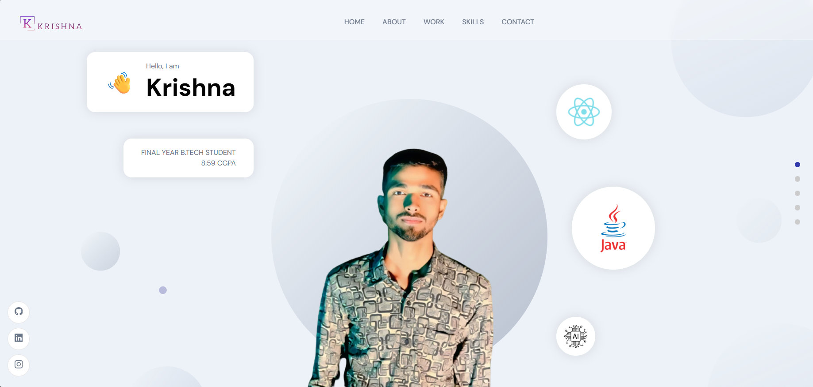

# Personal-Portfolio
A responsive developer portfolio built with React.js, integrated with Sanity CMS for dynamic content management. Includes sections for projects, skills, experiences, and more – ideal for showcasing backend, full-stack, and AI/ML capabilities.

## 🚀 Features

- Responsive design for desktop, tablet, and mobile
- Content managed via Sanity CMS
- Modular React components
- Dynamic projects and blog posts from Sanity
- Smooth animations and transitions
- SEO-friendly structure

## 🛠️ Tech Stack

- **Frontend:** React, Tailwind CSS / CSS Modules / Styled Components (choose your stack)
- **Backend / CMS:** Sanity.io
- **Deployment:** Vercel / Netlify / GitHub Pages (your choice)

## 📸 Screenshots




## 🧩 Folder Structure

```

personal-portfolio/
├── public/
├── src/
│   ├── components/
│   ├── pages/
│   ├── sanity/            # Sanity schema and client setup
│   └── App.js
├── studio/                # Sanity Studio
├── package.json
└── README.md

````

## 🧪 Getting Started

### 1. Clone the Repository

```bash
git clone https://github.com/yourusername/personal-portfolio.git
cd personal-portfolio
````

### 2. Install Dependencies

```bash
npm install
```

### 3. Set Up Sanity Studio

```bash
cd studio
sanity install
sanity start
```

Make sure you have a Sanity account and have created a project at [Sanity.io](https://www.sanity.io/).

### 4. Environment Variables

Create a `.env` file in the root of your React project with the following:

```env
REACT_APP_SANITY_PROJECT_ID=your_project_id
REACT_APP_SANITY_DATASET=production
REACT_APP_SANITY_API_VERSION=2023-01-01
```

### 5. Start the React App

```bash
cd ..
npm start
```

The app will be available at `http://localhost:3000`.

## 📦 Build and Deploy

To build the React app for production:

```bash
npm run build
```

Deploy the `build/` folder using your preferred platform (e.g., Vercel, Netlify).

## 🧑‍💻 Author

* [Krishna Sah](https://portfolio-krishnasah.netlify.app/)
* GitHub: [@Krishnasah206](https://github.com/Krishnasah206/Personal-Portfolio)

## 🤝 Contributing

Contributions, issues and feature requests are welcome!

## 📄 License

This project is licensed under the [MIT License](LICENSE).

```

---
