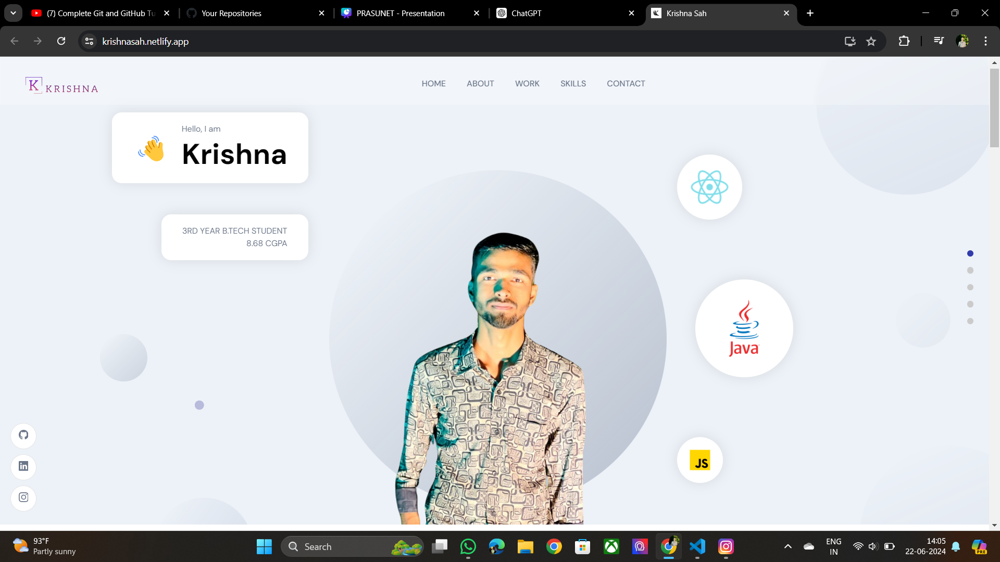
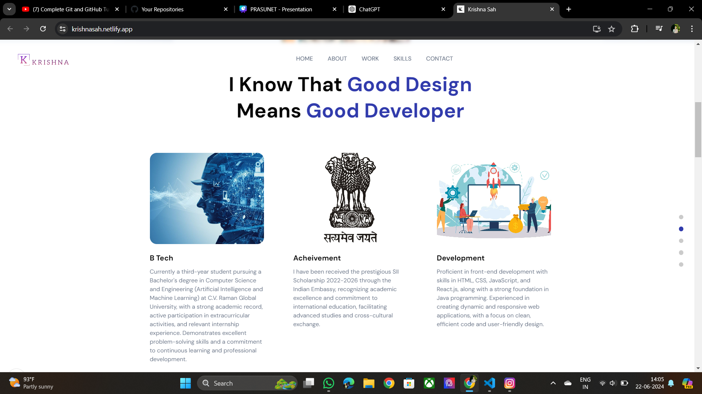
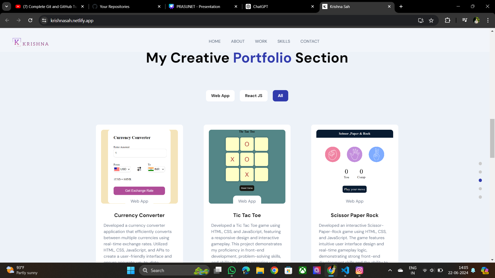
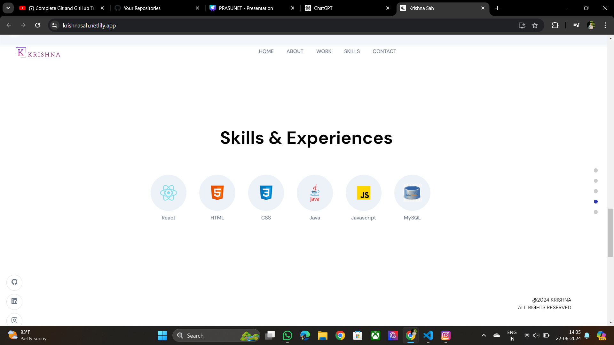
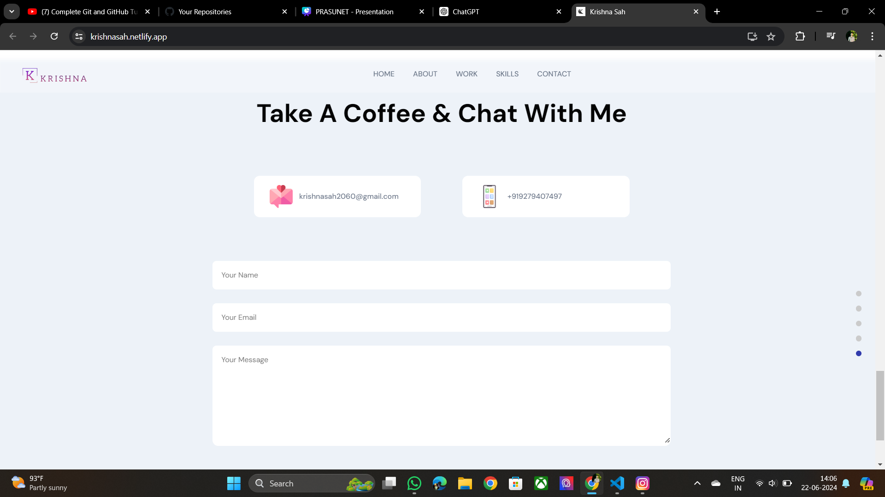

# Responsive Personal Portfolio Website

## Introduction

Welcome to the Responsive Personal Portfolio Website project! This project is Task 4 of the Prasunet Company Internship in Web Designing. The goal of this project is to create a modern, responsive personal portfolio website using React as the frontend framework and Sanity as the backend content management system. This portfolio website allows users to showcase their projects, skills, and professional experience in a visually appealing and easily navigable format.

## Features

- **Responsive Design**: The website is fully responsive and provides an optimal viewing experience across different devices and screen sizes.
- **Dynamic Content Management**: Uses Sanity as a backend CMS to manage and update portfolio content dynamically without changing the code.
- **Sectioned Layout**: Organized into sections such as Home, About, Work & Projects, Skills & Experience, and Contact for easy navigation.
- **Project Showcase**: A section to display various projects with details such as descriptions, images, and links.
- **Skill Display**: A section to showcase professional skills and proficiencies.
- **Experience Timeline**: A timeline section to highlight professional experiences and career progression.
- **Contact Form**: An interactive contact form to enable visitors to reach out directly from the website.

## Technologies Used

- **Frontend**:
  - **React**: A JavaScript library for building user interfaces.
  - **CSS**: Styling the components and layout of the website.
  - **React Router**: For handling navigation within the application.

- **Backend**:
  - **Sanity**: A headless CMS to manage and store content.

## Sections Overview

### Home
The landing page of the portfolio, providing a brief introduction and a visually appealing welcome to visitors.

### About
A section detailing personal background information, including education, interests, and a brief biography.

### Work & Projects
Showcases various projects with descriptions, images, and links to live demos or source code. This section highlights the user's work and contributions.

### Skills & Experience
Displays professional skills, proficiencies, and an experience timeline. This section provides an overview of the user's expertise and career progression.

### Contact
An interactive form allowing visitors to send messages directly through the website. Includes relevant contact information.

## How to Use

1. **Installation**: Clone the repository and run `npm install` to install all dependencies.
2. **Sanity Setup**: Ensure Sanity is set up and configured with the required schemas for managing portfolio content. Connect the frontend to the Sanity backend using the project ID and dataset.
3. **Running the Application**: Use `npm start` to run the React application locally. The website should be accessible on `http://localhost:3000`.
4. **Content Management**: Log in to the Sanity studio to add, update, or delete portfolio content. Changes made in Sanity will reflect on the website dynamically.

## File Structure

- `src/`: Contains all the React components, styles, and other frontend resources.
  - `components/`: Reusable UI components such as Navbar, Footer, ProjectCard, etc.
  - `pages/`: Page components such as Home, About, Work & Projects, Skills & Experience, Contact, etc.
  - `styles/`: CSS files for styling the components.
  - `App.js`: Main application component.
  - `index.js`: Entry point of the React application.
- `sanity/`: Configuration and schemas for the Sanity backend.

## Future Improvements

- **Dark Mode**: Implement a dark mode toggle for improved user experience.
- **Animations**: Add animations and transitions to enhance visual appeal.
- **SEO Optimization**: Improve SEO to increase visibility on search engines.
- **Blog Section**: Add a blog section to share articles and insights.
- **Testimonials**: Include a section for client or peer testimonials.

## Conclusion

The Responsive Personal Portfolio Website project demonstrates the integration of React and Sanity to create a dynamic, content-driven web application. This project showcases the ability to build modern web applications that are both visually appealing and highly functional. It serves as a significant addition to the Prasunet Company Internship portfolio, highlighting skills in both frontend and backend web development.

Explore the portfolio, manage your content with ease, and make the most of this powerful personal website!

Feel free to contribute to the project and share your feedback!

<h2> I have deploy this portfolio. You can Check Out👉 </h2> https://krishnasah.netlify.app/

